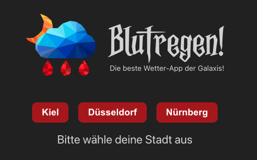
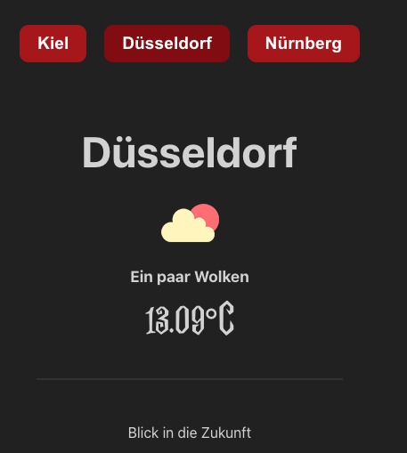
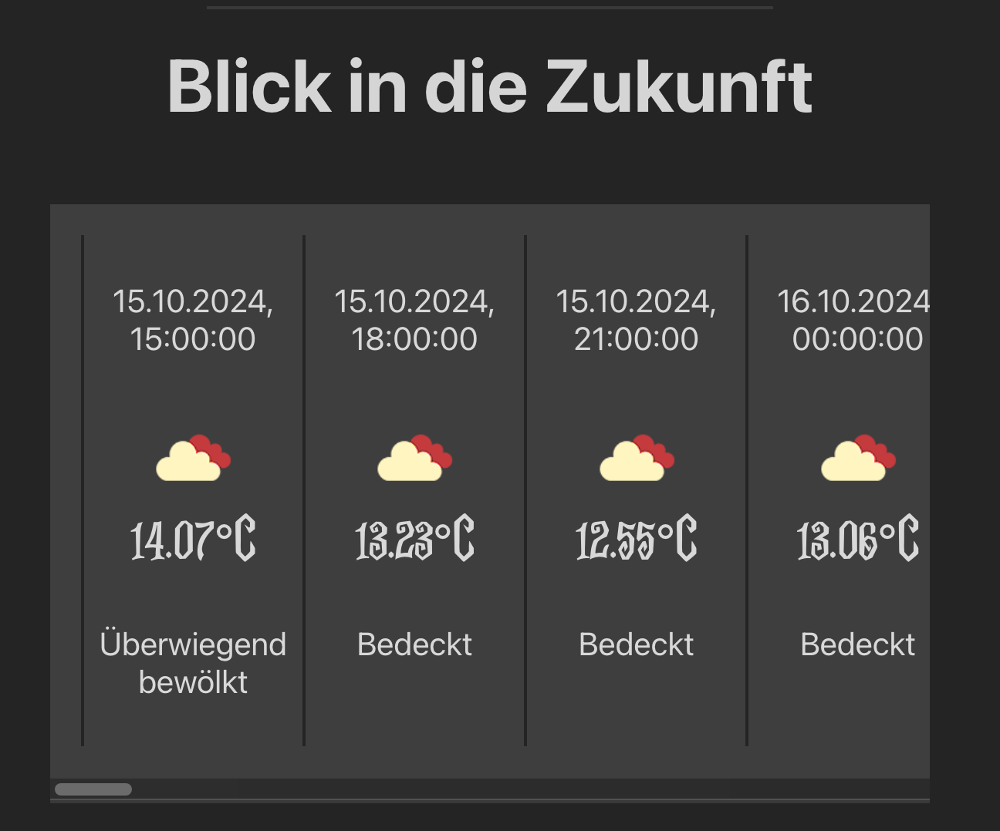

# Wetter-App
Eine kleine Browser-Wetter- App mit den Daten der openweathermap.org API.

 

## Table of Contents 📑

- [Demo](#demo)
- [Tech Stack](#tech-stack)
- [Projektvorschau](#Projektvorschau)
- [API Integration](#api-integration)
<!-- - [Database](#database) -->
<!-- - [Backend Routes](#backend-routes) -->
- [Design](#design)
- [Deployment](#deployment)
- [Contributors](#contributors)

 

## Demo

unsere Demo zu unserer Wetter-App "Blutregen" findest du hier: 

 

## Tech Stack:
            

 

## Projektvorschau

### Start - wähle eine Stadt:

Als Startseite haben wir nur unsere Buttons und die Aufforderung sich eine der drei Städte auszuwählen, von der man das Wetter sehen möchte.

### Aktuelles Wetter:

Sobald man  sich eine Stadt ausgesucht hat bekommt man direkt das aktuelle Wetter angezeigt

### Die nächsten Stunden und Tage:

Wenn man weiter Runterscrollt, bekommt man das Karusell indem sich alle zukünftigen angeben des Wetters enthalten sind. Dies gitl für die nächsten fünf Tage und wird immer im drei Stunden takt vorgestellt

 

## API Vorstellung und Integration

### Welche API wurde wie verwendent?
wir haben mit der <b><u>openweathermap.org</u></b> gearbeitet. Diese bietet zu übungszwecken einen kostenlosen Zugang für Schüler und Studenten an. hier haben wir mit unserem Key den Zugriff auf unterschiedliche API-Links bekommen. Entschieden haben wir uns für einen Link zum Wetter in Deutschland und haben uns drei Städte ausgesucht, für die wir das Wetter präsentieren wollten. Zusätlich zum aktuellen Wetter, konnte man mit dem kostenlosen Zugang noch das Wetter der nächsten fünf Tage erhalten (allerdings nur im drei Stunden takt) und haben dies ebenfalls mit auf unsere Browser-App eingebracht

### Fetchen einbinden 
weir haben zwei Fetchen geschrieben, die von unseren Buttons mit den Städtenahmen ausgelöst werden. der erste ist fürs aktuelle Wetter, der Zweite für die Vorschau.

 

## Design
Beim gestalten hatten wir jeglichen Freiraum und haben uns entschieden die ganze Wetter-App etwas <b>METAL</b> zu machen: Fetziger Name, fetziges Logo und die passende Gestaltung folgte sogleich! Alles in einem schwarz-roten Stil, das erfreut jedes dunkle Herz der anhänger von harter Musik. Zudem ist auch gerade Oktober und somit Spooky-Season 👻 somit auch wieder thematisch passend

 

## Deployment
Das Deployment haben wir über eine Netlify Page erstellt. 
hier gehts zu unserer Demoseite:
>>>>>link<<<<<<

 

## Contributors

Unser Team besteht aus zwei Köpfen. wir beide kommen aus dem Designbereich und befinden uns in der Umschulung zum Web-Developer und haben hierbei das Coden lieben gelernt. Gemeinsam haben wiruns mit eifer an diese Projekt gesetzt und ausgetobt.

Zu unseren Github Profilen:

- [Nana](https://github.com/Nana7782) 
- [Anne](https://github.com/Anne-SophieNehls) 

